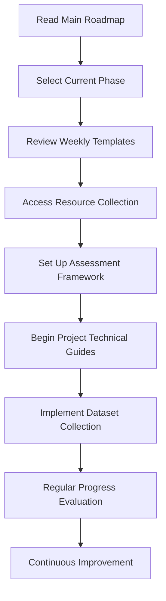

# Documentation Integration Guide

## Computational Drug Discovery Roadmap Program

### Core Program Documents

```
📁 Computational Drug Discovery Roadmap Program
├── 📄 comprehensive_drug_discovery_roadmap.md      [MAIN ROADMAP]
│   ├── Phases 1-3: 16-20 week preparation program
│   └── Links to all supporting documents
│
├── 📄 weekly_planning_templates.md                 [PLANNING TOOLS]
│   ├── Week-by-week templates for each phase
│   ├── Daily activity scheduling
│   └── Progress tracking frameworks
│
├── 📄 project_technical_guides.md                  [IMPLEMENTATION]
│   ├── Project A: Quantum-Classical Hybrid Algorithms
│   ├── Project B: Multi-Modal AI for Drug-Target Interactions
│   ├── Project C: Automated Drug Discovery Platform
│   └── Project D: Quantum Advantage Applications
│
├── 📄 comprehensive_resource_collection.md         [RESOURCES]
│   ├── Software tools & platforms
│   ├── Databases & datasets
│   ├── Educational resources
│   └── Professional development
│
├── 📄 assessment_rubrics.md                        [EVALUATION]
│   ├── Phase-specific assessment criteria
│   ├── Technical skills evaluation
│   └── Portfolio assessment guidelines
│
└── 📄 dataset_collection_guides.md                 [DATA MANAGEMENT]
    ├── Dataset acquisition strategies
    ├── Quality assurance frameworks
    └── FAIR principles implementation
```

### 1. Getting Started Workflow

**New Onboarding Process**



**Step-by-Step Integration:**

1. **Phase Selection** (Week 1)
   - Read `comprehensive_drug_discovery_roadmap.md` sections 1-2
   - Identify current skill level using `assessment_rubrics.md` self-evaluation
   - Select appropriate starting phase

2. **Weekly Planning Setup** (Week 1)
   - Choose relevant templates from `weekly_planning_templates.md`
   - Customize daily schedules based on individual needs
   - Set up progress tracking systems

3. **Resource Acquisition** (Week 1-2)
   - Follow software installation guides in `comprehensive_resource_collection.md`
   - Set up database access and accounts
   - Download required datasets using `dataset_collection_guides.md`

4. **Project Initiation** (Phase-dependent)
   - Select primary research project from `project_technical_guides.md`
   - Follow technical implementation workflows
   - Apply dataset collection protocols

### 2. Progress Tracking Integration

**Connecting Assessment with Learning Activities**

```python
# Example integration tracking system
class LearnerProgressTracker:
    def __init__(self):
        self.current_phase = None
        self.weekly_goals = []
        self.project_status = {}
        self.assessment_scores = {}
        self.resource_usage = {}

    def load_phase_requirements(self, phase_number):
        """Load requirements from comprehensive_drug_discovery_roadmap.md"""
        phase_map = {
            1: "Foundation Building (Months 1-6)",
            2: "Specialization & Research (Months 7-12)",
            3: "Advanced Projects (Months 13-18)",
            4: "Leadership & Innovation (Months 19-24)"
        }
        return phase_map.get(phase_number)

    def apply_weekly_template(self, week_number):
        """Apply template from weekly_planning_templates.md"""
        # Integration with weekly planning system
        pass

    def evaluate_progress(self):
        """Use rubrics from assessment_rubrics.md"""
        # Apply assessment criteria
        pass
```

### 3. Project-Documentation Cross-Reference

#### Project A: Quantum-Classical Hybrid Algorithms

**Documentation Integration Map:**

| Document | Relevant Sections | Purpose |
|----------|------------------|---------|
| `comprehensive_drug_discovery_roadmap.md` | Phase 2, Weeks 7-10 | Timeline and objectives |
| `weekly_planning_templates.md` | Phase 2 templates | Weekly activity structure |
| `project_technical_guides.md` | Project A full section | Implementation details |
| `comprehensive_resource_collection.md` | Quantum computing tools | Required software/platforms |
| `assessment_rubrics.md` | Phase 2 technical criteria | Evaluation standards |
| `dataset_collection_guides.md` | Project A datasets | Data acquisition protocols |

**Integration Checklist:**
- [ ] Week 7: Review Project A overview in main roadmap
- [ ] Week 7: Set up quantum development environment (resource collection)
- [ ] Week 8: Begin technical implementation (technical guides)
- [ ] Week 8: Acquire molecular datasets (dataset guides)
- [ ] Week 9: Follow weekly planning templates for structured progress
- [ ] Week 10: Self-assess using evaluation rubrics

#### Project B: Multi-Modal AI for Drug-Target Interactions

**Quick Reference Integration:**

```yaml
Timeline: Months 11-14 (Phase 3)
Primary Documents:
  - Main Guide: project_technical_guides.md → Project B
  - Planning: weekly_planning_templates.md → Phase 3 templates
  - Resources: comprehensive_resource_collection.md → AI/ML platforms
  - Data: dataset_collection_guides.md → Multi-modal datasets
  - Assessment: assessment_rubrics.md → Phase 3 criteria

Key Integration Points:
  - Multi-modal data preparation workflows
  - AI platform setup and configuration
  - Cross-validation with assessment criteria
  - Resource utilization optimization
```

## Cross-Document Validation Framework

### 1. Consistency Checks

**Automated Validation System:**

```python
def validate_documentation_consistency():
    """
    Validate cross-references and consistency across all documentation
    """
    validation_checks = {
        'timeline_consistency': check_phase_timelines(),
        'resource_availability': verify_resource_links(),
        'assessment_alignment': validate_rubric_alignment(),
        'project_completeness': check_project_coverage(),
        'template_synchronization': verify_template_updates()
    }
    return validation_checks

def check_phase_timelines():
    """Ensure phase timelines match across all documents"""
    # Validate that Phase 1-4 timelines are consistent
    roadmap_phases = extract_phases_from_roadmap()
    template_phases = extract_phases_from_templates()
    assessment_phases = extract_phases_from_assessments()

    return compare_phase_consistency(roadmap_phases, template_phases, assessment_phases)
```

### 2. Quality Assurance Checklist

**Document Integration QA:**
- [ ] All cross-references point to existing content
- [ ] Phase timelines consistent across documents
- [ ] Resource links are functional and up-to-date
- [ ] Assessment criteria align with learning objectives
- [ ] Project guides reference appropriate datasets
- [ ] Weekly templates cover all roadmap activities
- [ ] Technical guides include prerequisite checks

**Content Completeness QA:**
- [ ] Each project has corresponding assessment criteria
- [ ] All required datasets have collection guides
- [ ] Resource requirements are documented for each phase
- [ ] Weekly templates exist for all roadmap phases
- [ ] Technical implementation guides are complete

## Integration Best Practices

### 1. Navigation Strategies

**Efficient Document Usage:**

1. **Start with Overview**: Always begin with `comprehensive_drug_discovery_roadmap.md`
2. **Phase-Based Navigation**: Use phase numbers as primary navigation keys
3. **Cross-Reference Validation**: Verify information across multiple documents
4. **Template-First Planning**: Use weekly templates to structure daily activities
5. **Regular Assessment**: Apply rubrics monthly for progress evaluation

### 2. Customization Guidelines

**Adapting Documentation to Individual Needs:**

```markdown
## Personal Integration Checklist

### Phase 1 Customization:
- [ ] Adjust weekly templates based on prior experience
- [ ] Select subset of resources based on research focus
- [ ] Modify assessment criteria for personal goals
- [ ] Choose primary datasets for initial projects

### Phase 2-4 Adaptation:
- [ ] Select 2-3 primary projects from technical guides
- [ ] Focus resource collection on chosen specializations
- [ ] Customize assessment rubrics for career goals
- [ ] Develop personal dataset collection priorities
```

### 3. Continuous Improvement Framework

**Documentation Evolution Strategy:**

1. **Feedback Integration**: Regular updates based on user experience
2. **Version Control**: Track changes across all documentation
3. **Cross-Validation**: Periodic consistency checks
4. **Resource Updates**: Maintain current links and tool versions
5. **Assessment Refinement**: Improve evaluation criteria based on outcomes

## Implementation Timeline

### Month 1: Documentation Familiarization

- Week 1: Complete overview of all documents
- Week 2: Customize integration approach
- Week 3: Set up tracking and assessment systems
- Week 4: Begin Phase 1 implementation

### Month 2-24: Integrated Program Execution

- Monthly documentation reviews
- Quarterly integration assessments
- Bi-annual comprehensive evaluations
- Continuous cross-reference validation

## Support and Troubleshooting

### Common Integration Issues

1. **Timeline Conflicts**:
   - Solution: Prioritize main roadmap timelines
   - Adjust weekly templates as needed

2. **Resource Accessibility**:
   - Solution: Check alternative resources in collection
   - Document substitutions for future reference

3. **Assessment Alignment**:
   - Solution: Use rubrics as primary evaluation framework
   - Supplement with project-specific criteria

4. **Technical Guide Prerequisites**:
   - Solution: Complete foundational requirements first
   - Use resource collection for setup guidance

### Support Resources

- Technical support: [GitHub Issues]
- Community forum: [Research Community Links]
- Documentation updates: [Version Control System]
- Integration assistance: [Mentorship Network]

---

*This integration guide is maintained as part of the comprehensive roadmap documentation system. For updates and contributions, please refer to the project repository.*
