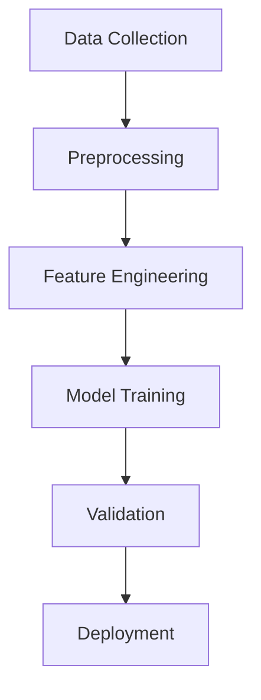

# Unified Roadmap for Computational Drug Discovery

## Table of Contents

- [Unified Roadmap for Computational Drug Discovery](#unified-roadmap-for-computational-drug-discovery)
  - [Table of Contents](#table-of-contents)
  - [Introduction](#introduction)
    - [Learning Objectives](#learning-objectives)
  - [Prerequisites](#prerequisites)
    - [Essential Prerequisites](#essential-prerequisites)
    - [Recommended Prerequisites](#recommended-prerequisites)
  - [Phase 1: Foundational Knowledge and Hands-On Skills](#phase-1-foundational-knowledge-and-hands-on-skills)
    - [Weeks 1-2: Python and ML Basics](#weeks-1-2-python-and-ml-basics)
      - [Focus Areas](#focus-areas)
      - [Activities and Outcomes](#activities-and-outcomes)
      - [Reference Materials](#reference-materials)
  - [Visual Aids](#visual-aids)
    - [Drug Discovery Pipeline](#drug-discovery-pipeline)
    - [Comparison of Tools and Libraries](#comparison-of-tools-and-libraries)

## Introduction

This roadmap is designed to prepare learners for computational drug discovery roles. It covers essential interdisciplinary skills, including Machine Learning (ML), Quantum Chemistry, Quantum Computing, and Molecular Modeling. The roadmap provides a structured program with hands-on projects, assessments, and real-world applications.

### Learning Objectives

By completing this roadmap, you will:

- Apply machine learning techniques to drug discovery problems.
- Understand and implement quantum chemistry calculations.
- Develop quantum computing algorithms for molecular systems.
- Build and validate QSAR models.
- Perform virtual screening and molecular optimization.
- Integrate multiple computational approaches for drug design.

## Prerequisites

### Essential Prerequisites

- **Programming**: Intermediate Python programming skills.
- **Mathematics**: Linear algebra, calculus, statistics.
- **Chemistry**: Basic organic chemistry and biochemistry.
- **Biology**: Understanding of proteins and drug-target interactions.

### Recommended Prerequisites

- Experience with Jupyter notebooks.
- Basic command-line usage.
- Git version control.
- Scientific computing (NumPy, pandas).

## Phase 1: Foundational Knowledge and Hands-On Skills

### Weeks 1-2: Python and ML Basics

**Objective**: Establish a strong foundation in Python for scientific computing and basic ML workflows.

#### Focus Areas

- Master NumPy, pandas, matplotlib for data manipulation and visualization.
- Understand scikit-learn workflows for classification and regression.
- Learn PyTorch or TensorFlow fundamentals.
- Practice with real chemical datasets.

#### Activities and Outcomes

- Analyze a drug discovery dataset (e.g., ChEMBL data).
- Create molecular property distributions and correlation matrices.
- Implement linear regression and random forest models for QSAR.
- Outcomes include:
  - Jupyter notebook with complete data analysis workflow.
  - Comparison of at least 3 different ML algorithms.
  - Visualization dashboard for molecular properties.

#### Reference Materials

- Python for Data Analysis (McKinney).
- Hands-On Machine Learning (Géron).
- ChEMBL database tutorials.
- Scikit-learn documentation.

...existing content from other phases and sections will be merged here...

---

## Visual Aids

### Drug Discovery Pipeline

### Comparison of Tools and Libraries

| Category           | Tools/Libraries                     | Key Features                          |
|--------------------|-------------------------------------|---------------------------------------|
| Cheminformatics    | RDKit, Mordred, ChEMBL              | Molecular representations, descriptors|
| Machine Learning   | scikit-learn, PyTorch, TensorFlow   | Classification, regression, deep learning|
| Molecular Modeling | OpenMM, MDTraj, PyMOL               | Molecular dynamics, visualization     |
| Quantum Chemistry  | Psi4, PySCF                        | Electronic structure calculations     |
| Quantum Computing  | Qiskit, PennyLane, Cirq            | Quantum algorithms, simulations       |
| Drug Discovery     | DeepChem, ODDT, PLIP               | Virtual screening, ADMET prediction   |

---

This unified roadmap consolidates all relevant content into a single document for easier navigation and clarity.
