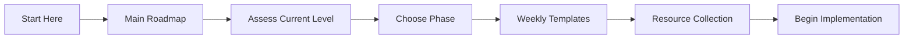
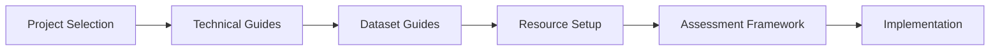
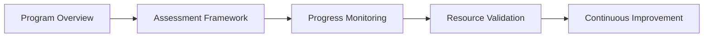

# Computational Drug Discovery Roadmap - Documentation Index

## 🎯 Program Overview

Welcome to the comprehensive documentation suite for the **Computational Drug Discovery Roadmap Program** - a structured learning program designed to prepare learners for excellence in computational drug discovery. This documentation provides everything needed to successfully navigate from foundational concepts to cutting-edge research applications.

### 📊 Program Statistics
- **Duration**: 16 weeks to 24 months (flexible based on background and goals)
- **Learning Tracks**: Multiple specialized paths (ML, Quantum Computing, Drug Design)
- **Projects**: Hands-on projects and real-world applications
- **Resources**: 500+ curated tools, datasets, and references
- **Assessment**: Comprehensive evaluation and progress tracking

---

## 🚀 Getting Started

### 🎯 **New to Computational Drug Discovery?**
**Start Here**: [Quick Start Guide](./getting_started/quick_start_guide.md) | [Learning Path Selector](./getting_started/learning_path_selector.md)

Choose your path based on your background:
- **Complete Beginner**: New to programming and drug discovery
- **Chemistry/Biology Background**: Wet lab experience, new to computational methods
- **Programming/ML Background**: Technical skills, new to chemistry and drug discovery
- **Advanced Researcher**: Experience in computational chemistry or related fields

### 📋 **Assess Your Readiness**
**Prerequisites Assessment**: [Complete Skills Assessment](./getting_started/prerequisites.md)

Evaluate your current knowledge in:
- Programming (Python, scientific computing)
- Mathematics (linear algebra, statistics, calculus)
- Chemistry (organic chemistry, medicinal chemistry)
- Biology (biochemistry, pharmacology)
- Technical tools (Git, command line, software)

---

## 📊 **Progress Tracking System**

### **Integrated Learning Experience**
Our unique progress tracking system seamlessly connects documentation with hands-on practice:

- **📓 Weekly Checkpoints**: Structured notebooks that verify learning objectives
- **💪 Practice Exercises**: Focused coding challenges and mini-projects
- **📁 Portfolio Development**: Build comprehensive project portfolio progressively
- **📈 Real-time Dashboard**: Track competency development and learning progress
- **👥 Peer Review System**: Collaborative learning and feedback

**Get Started with Progress Tracking**:
- [Progress Tracking System Overview](./planning/progress_tracking_system_plan.md)
- [Integration Guide](./planning/progress_tracking_integration_guide.md)
- [Week 1 Checkpoint](../notebooks/progress_tracking/week_01_checkpoint.ipynb) - Start here!

### **Interactive Dashboard**
Monitor your learning journey with our comprehensive dashboard:
```python
from tools.progress_dashboard import ProgressTracker
tracker = ProgressTracker("your_learner_id")
dashboard = tracker.create_progress_dashboard()
dashboard.display()
```

---

## 🗺️ **Main Learning Roadmap**

### [Unified Roadmap](./roadmaps/unified_roadmap.md)
**The comprehensive learning path for computational drug discovery**

**Structure**:
- **Phase 1**: Foundation Building (Python, ML, Cheminformatics, Quantum Basics)
- **Phase 2**: Specialization & Integration (Advanced methods and applications)
- **Phase 3**: Advanced Applications (Research projects and novel methods)
- **Phase 4**: Research & Development (Publication-quality research - Advanced track only)

**Learning Tracks Available**:
- **Beginner Track**: 16-20 weeks comprehensive coverage
- **Intermediate Track**: 12-16 weeks focused development
- **Advanced Track**: 24 months research and leadership development

---

## 🎓 **Specialized Learning Tracks**

### [Machine Learning Track](./roadmaps/specialized_tracks/ml_track.md)
**Advanced ML techniques for molecular and drug discovery applications**
- Graph Neural Networks and molecular architectures
- Multi-task and transfer learning
- Generative models for drug design
- Reinforcement learning for molecular optimization
- Interpretable AI and explainability

### [Quantum Computing Track](./roadmaps/specialized_tracks/quantum_track.md)
**Quantum computing applications in chemistry and drug discovery**
- Advanced quantum algorithms for chemistry
- Variational quantum algorithms (VQE, QAOA)
- Quantum machine learning
- Error mitigation and hybrid workflows
- Near-term quantum applications

### [Drug Design Track](./roadmaps/specialized_tracks/drug_design_track.md)
**Practical drug design methodologies and applications**
- Structure-based drug design (SBDD)
- Fragment-based drug discovery (FBDD)
- Lead optimization strategies
- Advanced drug modalities (PROTACs, covalent drugs)
- Experimental integration and validation

---

## 📚 **Core Documentation Suite**

### 📖 **Learning Resources**
- **[Comprehensive Resource Collection](./resources/comprehensive_resource_collection.md)**: 500+ curated tools, datasets, papers, and tutorials
- **[Dataset Collection Guides](./resources/dataset_collection_guides.md)**: Essential datasets for molecular ML and drug discovery
- **[Project Technical Guides](./resources/project_technical_guides.md)**: Detailed implementation guides for key projects

### 📅 **Planning and Organization**
- **[Weekly Planning Templates](./planning/weekly_planning_templates.md)**: Structured schedules and activity planning
- **[Implementation Checklist](./planning/implementation_checklist.md)**: Step-by-step setup and milestone tracking
- **[Assessment Rubrics](./reference/assessment_rubrics.md)**: Evaluation criteria and self-assessment tools

### 🔧 **Technical References**
- **[API Reference](./reference/api_reference.md)**: Technical documentation for ChemML project components
- **[Glossary](./reference/glossary.md)**: Comprehensive definitions and external resources
- **[FAQ](./reference/faq.md)**: Frequently asked questions and answers
- **[Troubleshooting Guide](./reference/troubleshooting.md)**: Common technical issues and solutions
- **[Validation Testing Framework](./validation_testing_framework.md)**: Quality assurance and testing procedures
- **[Documentation Integration Guide](./documentation_integration_guide.md)**: Advanced documentation workflows

### 📊 **Quick References**
- **[Quick Reference Card](./reference/quick_reference_card.md)**: Essential commands, functions, and workflows
- **[Advanced Computational Drug Discovery Roadmap](./roadmaps/advanced_computational_drug_discovery_roadmap.md)**: Research-level detailed roadmap

---

## 🎯 **Choose Your Starting Point**

### For New Learners
👋 **Just Getting Started?**
1. **[Quick Start Guide](./getting_started/quick_start_guide.md)** - Choose your learning path
2. **[Prerequisites Assessment](./getting_started/prerequisites.md)** - Evaluate your readiness
3. **[Main Roadmap](./roadmaps/unified_roadmap.md)** - Begin structured learning
4. **[Weekly Templates](./planning/weekly_planning_templates.md)** - Plan your schedule

### For Intermediate Learners
🔬 **Have Some Experience?**
1. **[Prerequisites Assessment](./getting_started/prerequisites.md)** - Identify your starting point
2. **[Specialized Tracks](./roadmaps/specialized_tracks/)** - Choose your focus area
3. **[Project Guides](./resources/project_technical_guides.md)** - Dive into hands-on projects
4. **[Resource Collection](./resources/comprehensive_resource_collection.md)** - Access advanced materials

### For Advanced Practitioners
🚀 **Ready for Research?**
1. **[Advanced Roadmap](./roadmaps/advanced_computational_drug_discovery_roadmap.md)** - Research-level pathway
2. **[Assessment Framework](./reference/assessment_rubrics.md)** - Evaluate expertise areas
3. **[Validation Framework](./validation_testing_framework.md)** - Quality assurance methods
4. **[Integration Guide](./documentation_integration_guide.md)** - Advanced workflows

### For Instructors and Mentors
👨‍🏫 **Teaching or Mentoring?**
1. **[Assessment Rubrics](./reference/assessment_rubrics.md)** - Evaluation frameworks
2. **[Implementation Checklist](./planning/implementation_checklist.md)** - Program setup guidance
3. **[Validation Framework](./validation_testing_framework.md)** - Quality standards
4. **[Weekly Templates](./planning/weekly_planning_templates.md)** - Course planning tools

---

## 🏆 **Learning Outcomes and Career Paths**

### Skills You'll Develop
- **Programming**: Python for scientific computing, data analysis, and ML
- **Machine Learning**: Classical ML, deep learning, and specialized molecular ML
- **Cheminformatics**: Molecular representations, descriptors, and property prediction
- **Quantum Computing**: Quantum algorithms for chemistry and hybrid workflows
- **Drug Design**: Structure-based design, lead optimization, and novel modalities
- **Research Skills**: Project management, publication writing, and collaboration

### Career Opportunities
- **Pharmaceutical Industry**: Computational medicinal chemist, ML scientist, SBDD specialist
- **Biotech**: Drug discovery scientist, AI researcher, platform developer
- **Academia**: Research scientist, principal investigator, collaborative partnerships
- **Technology**: Algorithm developer, software engineer, scientific consultant
- **Entrepreneurship**: Startup founder, technology transfer, commercialization

---

## 📈 **Assessment and Progress Tracking**

### Continuous Assessment
- **Weekly Progress Evaluations**: Track learning milestones
- **Project-Based Assessment**: Hands-on skill demonstration
- **Peer Review Sessions**: Community learning and feedback
- **Self-Assessment Tools**: Monitor your own progress

### Major Milestones
- **Phase Completion Projects**: Comprehensive skill demonstration
- **Specialized Track Completion**: Deep expertise in chosen area
- **Capstone Project**: Original research or application development
- **Portfolio Development**: Professional showcase of skills

---

## 🌟 **Success Stories and Community**

### Student Outcomes
- Successful career transitions from academia to industry
- Publication of novel computational drug discovery methods
- Development of open-source tools adopted by the community
- Leadership roles in pharmaceutical and biotech companies

### Community Support
- **Discussion Forums**: Connect with fellow learners and experts
- **Study Groups**: Collaborative learning opportunities
- **Mentorship Program**: Guidance from experienced practitioners
- **Industry Connections**: Networking with pharmaceutical professionals

---

## 🔧 **Technical Setup and Support**

### Environment Setup
- **Software Installation**: Python, RDKit, PyTorch, quantum computing frameworks
- **Cloud Computing**: AWS, Google Cloud, Azure options
- **Local Setup**: Docker containers and conda environments
- **Hardware Requirements**: Minimum specifications and recommendations

### Getting Help
- **Technical Support**: Troubleshooting guides and FAQ
- **Community Forums**: Peer support and expert advice
- **Office Hours**: Scheduled support sessions
- **Documentation Updates**: Continuous improvement process

---

## 📖 **How to Use This Documentation**

### Navigation Tips
- **Start with Quick Start Guide** to identify your learning path
- **Use the Prerequisites Assessment** to determine your starting point
- **Follow the Main Roadmap** for structured learning
- **Refer to Specialized Tracks** for deep expertise
- **Consult Technical References** for implementation details

### Learning Strategy
- **Set Clear Goals**: Define what you want to achieve
- **Plan Your Time**: Use weekly templates for scheduling
- **Track Progress**: Regular self-assessment and milestone tracking
- **Engage Community**: Participate in discussions and peer review
- **Apply Knowledge**: Work on projects and real-world applications

### Documentation Updates
This documentation is continuously updated based on:
- **User Feedback**: Suggestions and improvement requests
- **Technology Advances**: New tools and methodologies
- **Community Contributions**: Shared knowledge and resources
- **Industry Trends**: Evolving practices in computational drug discovery

---

## 🎯 **Ready to Begin Your Journey?**

The field of computational drug discovery is rapidly evolving, offering unprecedented opportunities to contribute to human health through innovative technology. Whether you're a complete beginner or an experienced researcher, this comprehensive roadmap will guide you toward expertise and impact.

**Your next step**: Choose your starting point above and begin your transformation into a computational drug discovery expert.

---

*This documentation index is your central hub for navigating the comprehensive roadmap program. Bookmark this page and return frequently as your primary navigation reference.*

---

## Quick Links
- 🚀 [Quick Start Guide](./getting_started/quick_start_guide.md)
- 📋 [Prerequisites Assessment](./getting_started/prerequisites.md)
- 🗺️ [Main Roadmap](./roadmaps/unified_roadmap.md)
- 🎓 [Specialized Tracks](./roadmaps/specialized_tracks/)
- 📚 [Resource Collection](./comprehensive_resource_collection.md)
- 📅 [Planning Templates](./weekly_planning_templates.md)
- Time management and productivity tools

**Best for**: Day-to-day planning, maintaining consistent progress, time management

---

### 🔧 [Project Technical Guides](./project_technical_guides.md)
**Detailed implementation guides for the 4 major research projects**
- **Project A**: Quantum-Classical Hybrid Algorithms for Drug Discovery
- **Project B**: Multi-Modal AI for Drug-Target Interactions
- **Project C**: Automated Drug Discovery Platform Development
- **Project D**: Quantum Advantage in Pharmaceutical Applications

**Best for**: Technical implementation, project execution, research methodology

---

### 📖 [Comprehensive Resource Collection](./comprehensive_resource_collection.md)
**Curated collection of tools, databases, educational materials, and professional resources**
- Software tools and computational platforms (50+ tools)
- Databases and datasets (30+ major databases)
- Educational resources and courses (100+ resources)
- Professional development and networking opportunities

**Best for**: Tool selection, learning resources, setting up development environment

---

### 📋 [Assessment Rubrics](./assessment_rubrics.md)
**Evaluation frameworks and performance measurement criteria**
- Phase-specific assessment criteria and scoring rubrics
- Technical skills evaluation matrices
- Research methodology assessment frameworks
- Portfolio development and presentation guidelines

**Best for**: Self-evaluation, progress measurement, goal setting, mentor discussions

---

### 📊 [Dataset Collection Guides](./dataset_collection_guides.md)
**Comprehensive guides for acquiring, managing, and utilizing research datasets**
- Dataset acquisition strategies and protocols
- Quality assurance and validation frameworks
- Project-specific dataset recommendations
- FAIR principles implementation and data governance

**Best for**: Data management, research project setup, ensuring data quality

## 🔄 Integration and Support Documentation

### 🔗 [Documentation Integration Guide](./documentation_integration_guide.md)
**Navigation framework connecting all documentation components**
- Cross-document navigation strategies
- Integration workflows and best practices
- Customization guidelines for individual needs
- Troubleshooting and support resources

**Best for**: Understanding how documents work together, efficient navigation, customization

---

### ✅ [Validation & Testing Framework](./validation_testing_framework.md)
**Quality assurance and consistency validation systems**
- Automated validation and testing procedures
- Content quality and accuracy verification
- Usability testing and improvement protocols
- Performance monitoring and optimization

**Best for**: Quality assurance, maintaining documentation integrity, continuous improvement

## 🚀 Quick Start Guide

### For New Learners (First Time Users)


**Step-by-Step:**
1. **Start with [Main Roadmap](./comprehensive_drug_discovery_roadmap.md)** - Read Introduction and Prerequisites sections
2. **Self-assess using [Assessment Rubrics](./assessment_rubrics.md)** - Determine your starting phase
3. **Set up planning system with [Weekly Templates](./weekly_planning_templates.md)** - Choose appropriate templates
4. **Access required resources from [Resource Collection](./comprehensive_resource_collection.md)** - Install tools and set up accounts
5. **Begin implementation following [Integration Guide](./documentation_integration_guide.md)** - Use integrated workflows

### For Experienced Researchers (Direct Project Focus)


**Direct Path:**
1. **Choose project from [Technical Guides](./project_technical_guides.md)** - Select primary research focus
2. **Set up datasets using [Dataset Guides](./dataset_collection_guides.md)** - Acquire and prepare data
3. **Configure environment with [Resource Collection](./comprehensive_resource_collection.md)** - Install specialized tools
4. **Establish evaluation framework with [Assessment Rubrics](./assessment_rubrics.md)** - Set performance metrics
5. **Begin research implementation** - Follow project-specific protocols

### For Mentors and Supervisors (Program Oversight)


**Oversight Framework:**
1. **Review [Main Roadmap](./comprehensive_drug_discovery_roadmap.md)** - Understand program structure and objectives
2. **Familiarize with [Assessment Rubrics](./assessment_rubrics.md)** - Learn evaluation criteria and methods
3. **Monitor progress using [Weekly Templates](./weekly_planning_templates.md)** - Track mentee development
4. **Validate resources in [Resource Collection](./comprehensive_resource_collection.md)** - Ensure tool accessibility
5. **Apply [Validation Framework](./validation_testing_framework.md)** - Maintain program quality

## 📈 Document Relationship Map

### Core Learning Path
```
Main Roadmap ←→ Weekly Templates ←→ Assessment Rubrics
     ↓               ↓                    ↓
Technical Guides ← Dataset Guides → Resource Collection
     ↓               ↓                    ↓
Integration Guide ←→ Validation Framework
```

### Cross-Reference Matrix
| Need | Primary Document | Supporting Documents |
|------|------------------|---------------------|
| **Getting Started** | Main Roadmap | Weekly Templates, Assessment Rubrics |
| **Daily Planning** | Weekly Templates | Main Roadmap, Integration Guide |
| **Project Implementation** | Technical Guides | Dataset Guides, Resource Collection |
| **Resource Setup** | Resource Collection | Technical Guides, Integration Guide |
| **Progress Evaluation** | Assessment Rubrics | Weekly Templates, Main Roadmap |
| **Data Management** | Dataset Guides | Technical Guides, Validation Framework |
| **Navigation Help** | Integration Guide | All documents |
| **Quality Assurance** | Validation Framework | All documents |

## 🎯 Learning Objectives by Phase

### Phase 1: Foundation Building (Months 1-6)
**Primary Documents**: Main Roadmap, Weekly Templates, Resource Collection
- Establish fundamental knowledge in quantum chemistry, ML, and molecular modeling
- Set up comprehensive development environment
- Complete foundational projects and assessments
- Build basic research and programming skills

### Phase 2: Specialization & Research (Months 7-12)
**Primary Documents**: Technical Guides, Dataset Guides, Assessment Rubrics
- Choose and begin implementation of major research project
- Develop specialized technical expertise
- Master advanced computational tools and methods
- Establish research methodology and data management practices

### Phase 3: Advanced Projects (Months 13-18)
**Primary Documents**: Technical Guides, Assessment Rubrics, Integration Guide
- Complete primary research project implementation
- Develop novel methodologies and approaches
- Begin publication and presentation activities
- Advance toward independent research capabilities

### Phase 4: Leadership & Innovation (Months 19-24)
**Primary Documents**: All documents for comprehensive integration
- Demonstrate research leadership and innovation
- Mentor junior researchers and share knowledge
- Develop collaborative networks and partnerships
- Plan transition to independent research position

## 🛠️ Technical Requirements

### Software Dependencies
**Installation Priority:**
1. **Essential Tools** (Week 1): Python, Jupyter, Git, conda/pip
2. **Computational Chemistry** (Week 2): RDKit, OpenMM, Gaussian/ORCA
3. **Machine Learning** (Week 3): scikit-learn, PyTorch/TensorFlow, pandas
4. **Quantum Computing** (Week 4): Qiskit, Cirq, PennyLane
5. **Specialized Tools** (Ongoing): Project-specific requirements

### Hardware Recommendations
- **Minimum**: 16GB RAM, 4-core CPU, 500GB SSD
- **Recommended**: 32GB RAM, 8-core CPU, 1TB SSD, GPU support
- **Optimal**: HPC cluster access, quantum computing platform access

### Cloud Platform Access
- **Required**: Google Colab, GitHub account
- **Recommended**: AWS/GCP/Azure credits, IBM Quantum account
- **Advanced**: Specialized platform access (varies by project)

## 📞 Support and Community

### Getting Help
1. **Documentation Issues**: Check [Validation Framework](./validation_testing_framework.md)
2. **Navigation Questions**: Refer to [Integration Guide](./documentation_integration_guide.md)
3. **Technical Problems**: Consult [Resource Collection](./comprehensive_resource_collection.md)
4. **Assessment Questions**: Review [Assessment Rubrics](./assessment_rubrics.md)

### Community Resources
- **Research Communities**: Listed in [Resource Collection](./comprehensive_resource_collection.md#research-communities)
- **Professional Networks**: Professional development section of [Resource Collection](./comprehensive_resource_collection.md)
- **Educational Forums**: Educational resources in [Resource Collection](./comprehensive_resource_collection.md)

### Contribution Guidelines
- **Documentation Updates**: Follow [Validation Framework](./validation_testing_framework.md) procedures
- **Resource Additions**: Submit via [Resource Collection](./comprehensive_resource_collection.md) update process
- **Assessment Improvements**: Enhance [Assessment Rubrics](./assessment_rubrics.md) based on experience

## 📊 Success Metrics and Outcomes

### Expected Outcomes by Phase
| Phase | Technical Skills | Research Capabilities | Professional Development |
|-------|-----------------|----------------------|-------------------------|
| **Phase 1** | Foundational proficiency | Basic research skills | Professional network initiation |
| **Phase 2** | Specialized expertise | Independent project execution | Research community engagement |
| **Phase 3** | Advanced technical mastery | Novel methodology development | Publication and presentation |
| **Phase 4** | Research leadership | Innovation and collaboration | Career transition readiness |

### Assessment Timeline
- **Monthly**: Progress evaluation using [Assessment Rubrics](./assessment_rubrics.md)
- **Quarterly**: Comprehensive skills assessment and goal adjustment
- **Bi-annually**: Portfolio review and career development planning
- **Annually**: Program effectiveness evaluation and improvement planning

## 🔄 Maintenance and Updates

### Documentation Versioning
- **Version Control**: Git-based tracking for all documentation changes
- **Release Schedule**: Quarterly updates with monthly patches
- **Validation Cycles**: Continuous validation using [Validation Framework](./validation_testing_framework.md)

### Content Evolution
- **User Feedback Integration**: Regular incorporation of user experiences and suggestions
- **Technology Updates**: Ongoing updates to reflect new tools, platforms, and methodologies
- **Research Advancement**: Integration of latest research findings and best practices

---

## 🎉 Ready to Begin?

**Choose your path:**

### 🌱 **New to Computational Drug Discovery**
→ Start with [Main Roadmap](./comprehensive_drug_discovery_roadmap.md) → Introduction

### 🚀 **Ready to Dive Into Projects**
→ Jump to [Technical Guides](./project_technical_guides.md) → Project Selection

### 📚 **Looking for Specific Resources**
→ Browse [Resource Collection](./comprehensive_resource_collection.md) → Category Selection

### 📊 **Want to Assess Current Skills**
→ Begin with [Assessment Rubrics](./assessment_rubrics.md) → Self-Evaluation

### 🗺️ **Need Navigation Help**
→ Check [Integration Guide](./documentation_integration_guide.md) → Workflow Selection

---

*This documentation index is your central hub for navigating the comprehensive roadmap program. Bookmark this page and return frequently as your primary navigation reference.*

**Last Updated**: {Current Date}
**Program Version**: 2.0
**Documentation Status**: Active Development
