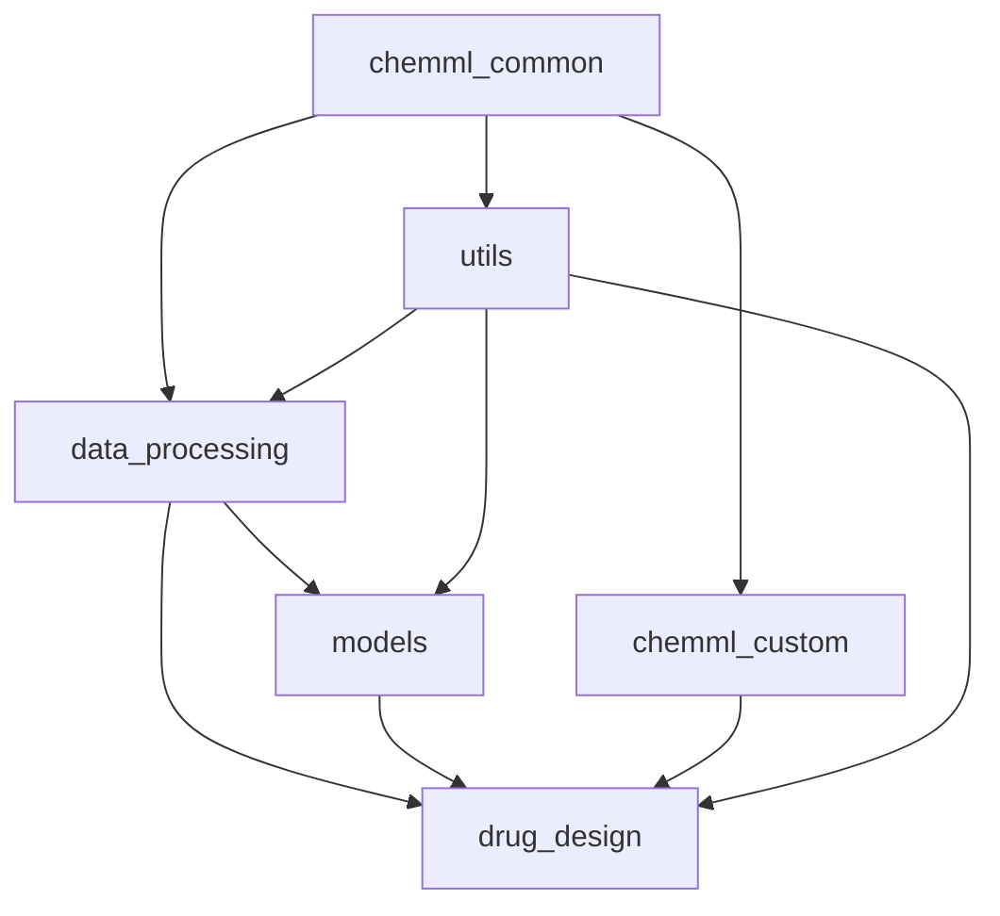

# 🏗️ ChemML src/ Architecture Guide

**Comprehensive guide to the ChemML source code organization, design patterns, and architectural decisions**

---

## 📚 Table of Contents

- [🎯 Architecture Overview](#-architecture-overview)
- [📁 Directory Structure](#-directory-structure)
- [🧩 Module Relationships](#-module-relationships)
- [🔧 Design Patterns](#-design-patterns)
- [🚀 Extension Guidelines](#-extension-guidelines)
- [📦 Package Dependencies](#-package-dependencies)
- [🛠️ Best Practices](#️-best-practices)
- [🔮 Future Architecture](#-future-architecture)

---

## 🎯 Architecture Overview

### **Design Philosophy**

ChemML follows a **modular, layered architecture** with clear separation of concerns:

1. **Separation of Concerns**: Each module has a single, well-defined responsibility
2. **Dependency Inversion**: High-level modules don't depend on low-level implementation details
3. **Open/Closed Principle**: Easy to extend without modifying existing code
4. **Interface Segregation**: Clean, focused interfaces between modules

### **Architecture Layers**

```
┌─────────────────────────────────────────────────────────────┐
│                    🎯 Application Layer                      │
│              (notebooks/, examples/, demos/)               │
├─────────────────────────────────────────────────────────────┤
│                    🧩 Domain Layer                          │
│          (drug_design/, models/, data_processing/)         │
├─────────────────────────────────────────────────────────────┤
│                  🔧 Infrastructure Layer                    │
│         (chemml_common/, chemml_custom/, utils/)           │
├─────────────────────────────────────────────────────────────┤
│                   📊 Data Access Layer                      │
│              (data/, cache/, external APIs)                │
└─────────────────────────────────────────────────────────────┘
```

---

## 📁 Directory Structure

### **src/ Root Organization**

```
src/
├── chemml_common/           # 🧩 Core framework infrastructure
├── chemml_custom/           # 🔬 Custom implementations (RDKit, etc.)
├── data_processing/         # 📊 Data handling and preprocessing
├── drug_design/             # 💊 Drug discovery algorithms
├── models/                  # 🤖 Machine learning models
└── utils/                   # 🛠️ Shared utilities and helpers
```

### **📊 Module Purpose Matrix**

| Module | Primary Purpose | Dependencies | Exports |
|--------|----------------|--------------|---------|
| `chemml_common/` | Framework infrastructure, configuration | None (base layer) | Config, logging, base classes |
| `chemml_custom/` | Custom implementations avoiding deprecations | `chemml_common/` | Custom featurizers, models |
| `data_processing/` | Molecular data handling and preprocessing | `chemml_common/`, external libs | Preprocessors, feature extractors |
| `drug_design/` | Drug discovery specific algorithms | `data_processing/`, `models/` | QSAR models, optimization |
| `models/` | ML model implementations (classical + quantum) | `data_processing/`, `chemml_common/` | Trained models, predictors |
| `utils/` | Cross-cutting utilities | `chemml_common/` | IO, visualization, validation |

---

## 🧩 Module Relationships

### **Dependency Graph**



### **Communication Patterns**

#### **1. Framework Layer (`chemml_common/`)**
- **Role**: Foundation for all other modules
- **Provides**: Configuration, logging, base classes, error handling
- **Pattern**: Dependency injection, factory patterns
- **Dependencies**: None (pure foundation)

```python
# Example: Base configuration for all modules
from chemml_common.config import ChemMLConfig
from chemml_common.base import BaseProcessor

class MyProcessor(BaseProcessor):
    def __init__(self, config: ChemMLConfig):
        super().__init__(config)
```

#### **2. Custom Implementation Layer (`chemml_custom/`)**
- **Role**: Modern, deprecation-free implementations
- **Provides**: RDKit wrappers, custom featurizers, model bridges
- **Pattern**: Adapter pattern, strategy pattern
- **Dependencies**: `chemml_common/` for base classes

```python
# Example: Custom featurizer avoiding deprecation warnings
from chemml_custom.featurizers import ModernMorganFingerprint
from chemml_common.base import BaseFeaturizer

class HybridFeaturizer(BaseFeaturizer):
    def __init__(self):
        self.morgan = ModernMorganFingerprint()
```

#### **3. Data Processing Layer (`data_processing/`)**
- **Role**: Transform raw molecular data into ML-ready features
- **Provides**: Molecule preprocessing, feature extraction, validation
- **Pattern**: Pipeline pattern, transformation chains
- **Dependencies**: `chemml_common/` for base classes, external libs for computation

```python
# Example: Processing pipeline
from data_processing.molecular_preprocessing import MoleculeStandardizer
from data_processing.feature_extraction import FeatureExtractor

pipeline = MoleculeStandardizer() >> FeatureExtractor()
```

#### **4. Models Layer (`models/`)**
- **Role**: Implement and manage ML models (classical and quantum)
- **Provides**: Model training, prediction, evaluation
- **Pattern**: Strategy pattern, factory pattern for model selection
- **Dependencies**: `data_processing/` for features, `chemml_common/` for base classes

```python
# Example: Model factory
from models.classical_ml import RandomForestModel
from models.quantum_ml import VQEModel

class ModelFactory:
    @staticmethod
    def create_model(model_type: str, config: ChemMLConfig):
        if model_type == "rf":
            return RandomForestModel(config)
        elif model_type == "vqe":
            return VQEModel(config)
```

#### **5. Drug Design Layer (`drug_design/`)**
- **Role**: High-level drug discovery workflows and algorithms
- **Provides**: QSAR modeling, molecular optimization, virtual screening
- **Pattern**: Facade pattern, workflow orchestration
- **Dependencies**: All other layers (highest level of abstraction)

```python
# Example: High-level drug discovery workflow
from drug_design.qsar_modeling import QSARPipeline
from drug_design.molecular_optimization import PropertyOptimizer

class DrugDiscoveryWorkflow:
    def __init__(self):
        self.qsar = QSARPipeline()
        self.optimizer = PropertyOptimizer()
```

#### **6. Utilities Layer (`utils/`)**
- **Role**: Cross-cutting concerns and shared utilities
- **Provides**: IO operations, visualization, validation, helper functions
- **Pattern**: Utility pattern, helper functions
- **Dependencies**: `chemml_common/` for configuration, minimal external dependencies

---

## 🔧 Design Patterns

### **1. Configuration Pattern**
All modules use centralized configuration through `ChemMLConfig`:

```python
# Used throughout all modules
from chemml_common.config import ChemMLConfig

class AnyProcessor:
    def __init__(self, config: ChemMLConfig):
        self.config = config
        self.output_dir = config.output_dir
        self.log_level = config.log_level
```

### **2. Base Class Hierarchy**
Common functionality through inheritance:

```python
# Base classes in chemml_common/
class BaseProcessor:
    """Base for all processing classes"""

class BaseFeaturizer(BaseProcessor):
    """Base for all featurizers"""

class BaseModel(BaseProcessor):
    """Base for all models"""

# Usage in specific modules
from chemml_common.base import BaseFeaturizer

class MorganFeaturizer(BaseFeaturizer):
    def featurize(self, molecules):
        # Implementation
        pass
```

### **3. Factory Pattern**
Dynamic object creation:

```python
# In models/ module
class ModelFactory:
    _models = {
        'random_forest': RandomForestModel,
        'neural_network': NeuralNetworkModel,
        'quantum_vqe': VQEModel
    }

    @classmethod
    def create(cls, model_type: str, **kwargs):
        return cls._models[model_type](**kwargs)
```

### **4. Pipeline Pattern**
Data transformation chains:

```python
# In data_processing/ module
class ProcessingPipeline:
    def __init__(self):
        self.steps = []

    def add_step(self, processor):
        self.steps.append(processor)
        return self

    def process(self, data):
        for step in self.steps:
            data = step.process(data)
        return data
```

### **5. Adapter Pattern**
Integrating external libraries:

```python
# In chemml_custom/ module
class DeepChemAdapter:
    """Adapter to use DeepChem models with our interface"""

    def __init__(self, deepchem_model):
        self.model = deepchem_model

    def predict(self, features):
        # Adapt DeepChem interface to our standard
        return self.model.predict(features)
```

---

## 🚀 Extension Guidelines

### **Adding New Functionality**

#### **1. New Featurizer**
```python
# Place in: chemml_custom/featurizers.py
from chemml_common.base import BaseFeaturizer

class MyCustomFeaturizer(BaseFeaturizer):
    def __init__(self, config: ChemMLConfig):
        super().__init__(config)

    def featurize(self, molecules):
        # Implementation
        pass
```

#### **2. New Model**
```python
# Place in: models/classical_ml/ or models/quantum_ml/
from chemml_common.base import BaseModel

class MyNewModel(BaseModel):
    def train(self, X, y):
        # Training implementation
        pass

    def predict(self, X):
        # Prediction implementation
        pass
```

#### **3. New Workflow**
```python
# Place in: drug_design/
from chemml_common.base import BaseWorkflow

class MyWorkflow(BaseWorkflow):
    def execute(self, inputs):
        # Workflow implementation
        pass
```

### **Testing New Code**

1. **Unit Tests**: Place in `tests/unit/test_<module>/`
2. **Integration Tests**: Place in `tests/integration/`
3. **Follow naming convention**: `test_<functionality>.py`

### **Documentation Requirements**

1. **Docstrings**: All public methods must have docstrings
2. **Type hints**: Use type hints for all function signatures
3. **Examples**: Include usage examples in docstrings
4. **Update API docs**: Add to relevant documentation files

---

## 📦 Package Dependencies

### **Internal Dependencies**

```
chemml_common/     (no internal dependencies)
     ↑
chemml_custom/     (depends on: chemml_common)
     ↑
data_processing/   (depends on: chemml_common, chemml_custom)
     ↑
models/            (depends on: chemml_common, data_processing)
     ↑
drug_design/       (depends on: all above)
     ↑
utils/             (depends on: chemml_common)
```

### **External Dependencies**

| Module | Key External Dependencies | Purpose |
|--------|--------------------------|---------|
| `chemml_common/` | pydantic, pathlib | Configuration management |
| `chemml_custom/` | rdkit, numpy | Molecular processing |
| `data_processing/` | pandas, scikit-learn | Data manipulation |
| `models/classical_ml/` | scikit-learn, xgboost | Classical ML |
| `models/quantum_ml/` | qiskit, pennylane | Quantum computing |
| `drug_design/` | deepchem (optional) | Drug discovery |
| `utils/` | matplotlib, plotly | Visualization |

### **Dependency Management**

1. **Required dependencies**: Listed in `requirements.txt`
2. **Optional dependencies**: Handled with try/except imports
3. **Version constraints**: Specified to avoid conflicts
4. **Fallback implementations**: For missing optional libraries

---

## 🛠️ Best Practices

### **Code Organization**

1. **One class per file** for major components
2. **Group related functions** in modules
3. **Clear imports** - explicit is better than implicit
4. **Consistent naming** - follow PEP 8 conventions

### **Error Handling**

```python
# Good: Specific error handling
try:
    from rdkit import Chem
except ImportError as e:
    logger.warning("RDKit not available, using fallback")
    raise ChemMLImportError("RDKit required for this functionality") from e
```

### **Configuration Usage**

```python
# Good: Use injected configuration
class MyProcessor:
    def __init__(self, config: ChemMLConfig):
        self.config = config
        self.output_dir = config.output_dir

# Avoid: Global configuration access
def bad_function():
    config = get_global_config()  # Don't do this
```

### **Logging**

```python
# Good: Module-level logger
import logging
logger = logging.getLogger(__name__)

class MyClass:
    def process(self):
        logger.info("Starting processing")
        # ... implementation
        logger.debug("Processing completed")
```

---

## 🔮 Future Architecture

### **Planned Enhancements**

#### **1. Plugin Architecture**
- Dynamic loading of custom featurizers and models
- Registry pattern for extensibility
- Configuration-driven plugin selection

#### **2. Microservices Support**
- REST API endpoints for each major functionality
- Containerized deployment of individual modules
- Message queue integration for async processing

#### **3. Distributed Computing**
- Support for distributed model training
- Cloud-native architecture patterns
- Auto-scaling based on workload

#### **4. Advanced Caching**
- Redis/Memcached integration
- Intelligent cache invalidation
- Distributed caching for multi-node setups

### **Migration Path**

1. **Phase 1**: Strengthen current modular architecture
2. **Phase 2**: Implement plugin system
3. **Phase 3**: Add microservices capabilities
4. **Phase 4**: Cloud-native transformation

---

## 📋 Quick Reference

### **Where to Add New Code**

| Functionality | Location | Base Class |
|---------------|----------|------------|
| Molecular featurizer | `chemml_custom/featurizers.py` | `BaseFeaturizer` |
| Data preprocessor | `data_processing/` | `BaseProcessor` |
| ML model | `models/classical_ml/` or `models/quantum_ml/` | `BaseModel` |
| Drug discovery workflow | `drug_design/` | `BaseWorkflow` |
| Utility function | `utils/` | None (functions) |
| Configuration option | `chemml_common/config.py` | `ChemMLConfig` |

### **Key Design Principles**

1. **Dependency Direction**: Always depend on abstractions, not concretions
2. **Single Responsibility**: Each module/class has one reason to change
3. **Open/Closed**: Open for extension, closed for modification
4. **Interface Segregation**: Many specific interfaces > one general interface
5. **Dependency Inversion**: Depend on abstractions, not details

---

**🏗️ Architecture Document Version**: 1.0
**📅 Last Updated**: June 14, 2025
**👥 Maintainers**: ChemML Development Team

*This document is a living guide - update it as the architecture evolves!*
