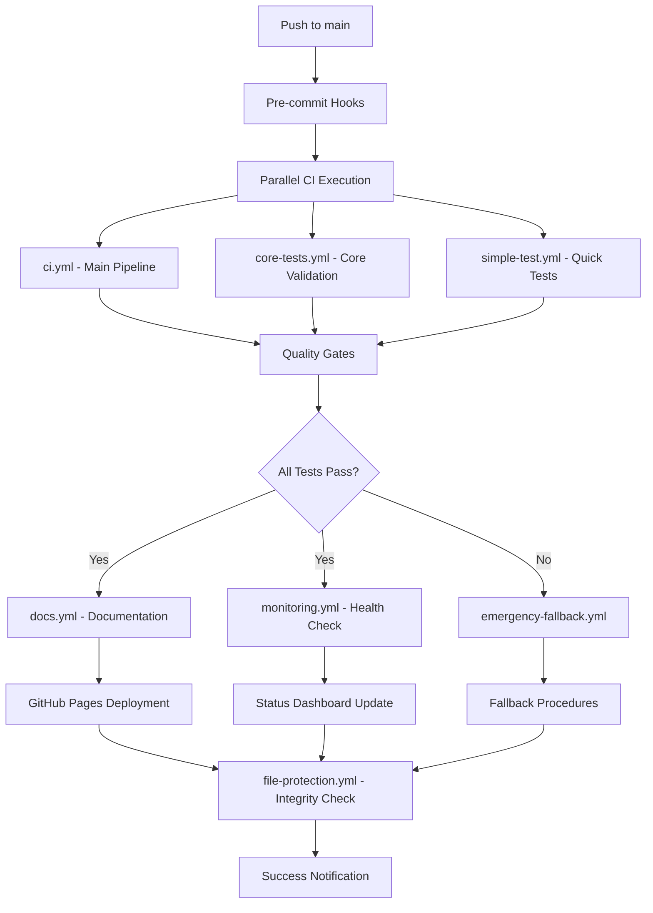

# 🏗️ QeMLflow CI/CD Architecture Documentation

**Version**: 1.0  
**Date**: June 20, 2025  
**Status**: Enterprise-Grade Production Ready

---

## 📊 **Current Workflow Inventory**

### **Core CI/CD Workflows** (5)
1. **ci.yml** - Main CI pipeline with pre-commit hooks, testing, linting
2. **ci-cd.yml** - Full CI/CD pipeline with deployment capabilities  
3. **core-tests.yml** - Core functionality validation
4. **gradual-ci.yml** - Progressive CI implementation
5. **simple-test.yml** - Lightweight quick tests

### **Specialized Workflows** (4)
6. **docs.yml** - Documentation building and GitHub Pages deployment
7. **dependencies.yml** - Dependency management and vulnerability scanning
8. **monitoring.yml** - Automated health monitoring and status checks
9. **file-protection.yml** - Critical file integrity protection

### **Reliability & Fallback** (3)
10. **emergency-fallback.yml** - Emergency procedures and fallback mechanisms
11. **release.yml** - Automated release management and tagging
12. **quick-health.yml** - Rapid health assessment
13. **super-simple.yml** - Minimal fallback testing

---

## 🔄 **Workflow Architecture Flow**



---

## 🎯 **Enhancement Opportunities**

### **Phase 2.1 Improvements**

#### **1. Matrix Testing Enhancement**
**Current**: Python 3.9, 3.10, 3.11  
**Enhancement**: Add OS matrix and dependency variations
```yaml
strategy:
  matrix:
    os: [ubuntu-latest, macos-latest, windows-latest]
    python-version: [3.9, 3.10, 3.11, 3.12]
    dependency-set: [minimal, standard, full]
```

#### **2. Self-Healing Mechanisms**
**Current**: Basic fallback workflows  
**Enhancement**: Intelligent failure recovery
- Automatic retry with exponential backoff
- Dynamic workflow selection based on failure type
- Cross-workflow communication and coordination

#### **3. Deployment Pipeline Stages**
**Current**: Direct deployment to main  
**Enhancement**: Multi-stage deployment
```
Development → Staging → Production
    ↓           ↓          ↓
  Auto-test   Manual     Gradual
             Review     Rollout
```

---

## 🔧 **Implementation Roadmap**

### **Week 1: Architecture Enhancement**
- [ ] Implement OS matrix testing
- [ ] Add dependency variation testing  
- [ ] Create staging environment workflow
- [ ] Enhance failure recovery mechanisms

### **Week 2: Self-Healing Implementation**
- [ ] Add automatic retry logic
- [ ] Implement intelligent fallback selection
- [ ] Create cross-workflow coordination
- [ ] Add real-time failure analytics

### **Week 3: Deployment Pipeline**
- [ ] Set up staging deployment
- [ ] Implement blue-green deployment
- [ ] Add automated rollback mechanisms
- [ ] Create deployment health checks

---

## ✅ **Quality Gates & Success Criteria**

### **Technical Requirements**
- All workflows must pass on all OS/Python combinations
- Maximum pipeline execution time: 15 minutes
- Zero false positives in failure detection
- 99.5% pipeline reliability target

### **Operational Requirements**
- Self-healing must resolve 80% of transient failures
- Mean Time to Recovery (MTTR) < 15 minutes
- Automated rollback within 5 minutes of detection
- Zero manual intervention for standard deployments

---

*This architecture ensures QeMLflow maintains enterprise-grade reliability while enabling rapid, safe development and deployment.*
