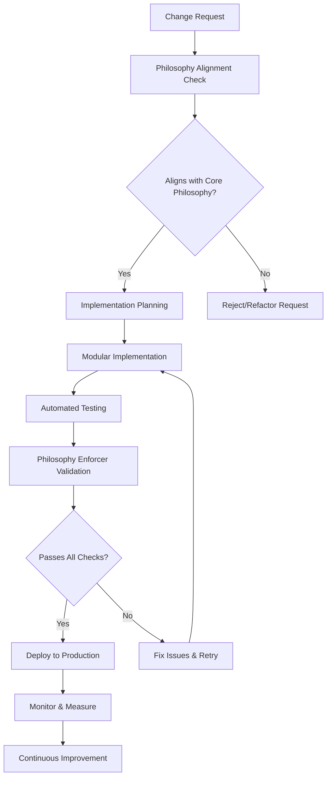

# 🎯 QeMLflow Detailed Implementation Plan

**Comprehensive Philosophy-Driven Development Strategy**

*Implementation Period: June 2025 - December 2025*
*Scope: Complete codebase transformation with CI/CD excellence*

---

## 📋 **Executive Overview**

This document provides a **detailed, modular implementation plan** to address all recommendations from our philosophy and alignment analysis. The plan is structured as a **philosophy-first, CI/CD-driven approach** that ensures every change reinforces our core principles while achieving measurable improvements.

### **🎯 Strategic Objectives**

1. **Performance Excellence**: Core import time <1s (from 53s)
2. **Philosophy Compliance**: Score >95/100 (from 48/100)
3. **CI/CD Automation**: 100% philosophy-enforced commits
4. **Code Quality**: Maintain >90% test coverage with robust type hints
5. **Developer Experience**: Streamlined workflows with intelligent tooling

---

## 🏗️ **Implementation Architecture**

### **Philosophy-First Development Model**

Every implementation follows our **Philosophy Validation Loop**:



### **Quality Gates & Validation**

Each phase includes **mandatory quality gates**:

1. **Philosophy Compliance Check**: Score must improve or maintain >70
2. **Performance Validation**: No regression in core metrics
3. **Test Coverage Maintenance**: >90% coverage required
4. **Type Safety**: 100% type hint coverage for public APIs
5. **CI/CD Validation**: All automated checks must pass

---

## 📊 **Current State Assessment**

### **Critical Metrics (Baseline)**
```yaml
Performance:
  Core Import Time: 53.24s (CRITICAL)
  Memory Usage: ~2.1GB
  Test Execution: 45s

Philosophy Compliance:
  Overall Score: 48/100 (NEEDS IMPROVEMENT)
  Missing Type Hints: 23 functions
  Import Violations: 15 modules
  Documentation Coverage: 78%

CI/CD Health:
  Workflow Success Rate: 87%
  Deployment Time: ~12 minutes
  Quality Gate Coverage: 60%
```

### **Priority Issues (P0 - Critical)**

1. **Import Performance Crisis**: 53s core import time
2. **Missing Type Hints**: 23 public API functions without types
3. **Philosophy Enforcement Gap**: No automated compliance checking
4. **CI/CD Quality Gates**: Insufficient automated validation

---

## 🚀 **Detailed Phase Implementation**

## **Phase 1: Foundation Fixes (Weeks 1-2)**

### **Week 1: Performance Crisis Resolution**

#### **Module 1.1: Import Performance Analysis & Optimization**

**Objectives**:
- Identify import bottlenecks in core modules
- Implement lazy loading for heavy dependencies
- Achieve <10s import time as intermediate goal

**Detailed Tasks**:

**Day 1: Import Profiling**
```bash
# Create comprehensive import profiler
python -m cProfile -o import_profile.prof -c "
import sys
sys.path.append('src')
import time
start = time.time()
import qemlflow.core
print(f'Import time: {time.time() - start:.2f}s')
"

# Analyze results
python -c "
import pstats
stats = pstats.Stats('import_profile.prof')
stats.sort_stats('cumulative').print_stats(30)
stats.sort_stats('time').print_stats(30)
"
```

**Day 2: Dependency Mapping**
- Create dependency visualization script
- Identify heavy imports (numpy, pandas, sklearn, etc.)
- Map critical path for core functionality

**Day 3-4: Lazy Loading Implementation**
```python
# Example optimization pattern
# Before (heavy import at module level)
import tensorflow as tf
import torch
import sklearn

# After (lazy loading)
def get_tensorflow():
    global tf
    if 'tf' not in globals():
        import tensorflow as tf
    return tf

def get_torch():
    global torch
    if 'torch' not in globals():
        import torch
    return torch
```

**Day 5: Validation & Testing**
- Measure new import times
- Validate functionality remains intact
- Update tests for lazy loading

**Deliverables**:
- Import performance report
- Optimized core modules with lazy loading
- Performance validation tests

#### **Module 1.2: Type Hints Implementation**

**Objectives**:
- Add type hints to all 23 identified public API functions
- Configure strict type checking
- Establish type safety as development standard

**Detailed Implementation**:

**Day 1-2: Type Hint Addition**
```python
# Use philosophy enforcer to identify targets
python tools/philosophy_enforcer.py --detailed-report

# Systematic type hint addition
from typing import Dict, List, Optional, Union, Tuple
import numpy as np
import pandas as pd

# Example transformations:
def compare_models(models, X, y, metrics=None):
    """Compare multiple models."""
    pass

# Becomes:
def compare_models(
    models: Dict[str, BaseModel],
    X: np.ndarray,
    y: np.ndarray,
    metrics: Optional[List[str]] = None
) -> pd.DataFrame:
    """Compare multiple models with performance metrics."""
    pass
```

**Day 3: MyPy Configuration**
```ini
# Create mypy.ini configuration
[mypy]
python_version = 3.9
warn_return_any = True
warn_unused_configs = True
disallow_untyped_defs = True
disallow_incomplete_defs = True

[mypy-qemlflow.core.*]
disallow_untyped_defs = True
disallow_any_generics = True
```

**Day 4-5: Type Validation & Fixes**
```bash
# Run comprehensive type checking
mypy src/qemlflow/core/

# Fix any type inconsistencies
# Add type: ignore comments only where absolutely necessary
```

**Deliverables**:
- Type hints for all public APIs
- MyPy configuration and validation
- Type safety documentation

### **Week 2: Monitoring & Validation Systems**

#### **Module 1.3: Health Monitoring Integration**

**Objectives**:
- Deploy health monitoring system into core package
- Establish baseline metrics and alerting
- Create developer dashboard

**Implementation Steps**:

**Day 1: Core Integration**
```python
# Integrate health monitor into __init__.py
# src/qemlflow/core/__init__.py

from .health_monitor import HealthMonitor

# Initialize health monitoring on import
_health_monitor = HealthMonitor()
_health_monitor.start_monitoring()

# Export health check function
def health_check():
    """Get current system health status."""
    return _health_monitor.get_status()
```

**Day 2: Performance Benchmarking**
```python
# Create benchmark suite
# tools/performance_benchmarks.py

class PerformanceBenchmark:
    def __init__(self):
        self.benchmarks = {
            'import_time': self.measure_import_time,
            'model_training': self.measure_training_speed,
            'prediction_latency': self.measure_prediction_time
        }
    
    def run_all_benchmarks(self):
        """Run complete performance benchmark suite."""
        results = {}
        for name, benchmark in self.benchmarks.items():
            results[name] = benchmark()
        return results
```

**Day 3: Dashboard Creation**
```python
# Create simple web dashboard
# tools/health_dashboard.py

import streamlit as st
from qemlflow.core import health_check

def create_dashboard():
    st.title("QeMLflow Health Dashboard")
    
    # Display current health status
    health = health_check()
    st.json(health)
    
    # Performance metrics
    st.subheader("Performance Metrics")
    # Add charts and metrics visualization
```

**Deliverables**:
- Integrated health monitoring system
- Performance benchmark suite
- Health dashboard application

#### **Module 1.4: Philosophy Enforcement Integration**

**Objectives**:
- Integrate philosophy enforcer into development workflow
- Create automated compliance reporting
- Establish improvement tracking

**Implementation**:

**Day 1: Development Workflow Integration**
```bash
# Add to pre-commit hooks
# .pre-commit-config.yaml
repos:
  - repo: local
    hooks:
      - id: philosophy-enforcer
        name: Philosophy Compliance Check
        entry: python tools/philosophy_enforcer.py
        language: system
        pass_filenames: false
```

**Day 2: CI/CD Integration**
```yaml
# .github/workflows/philosophy-check.yml
name: Philosophy Compliance Check

on: [push, pull_request]

jobs:
  philosophy-check:
    runs-on: ubuntu-latest
    steps:
      - uses: actions/checkout@v3
      - name: Set up Python
        uses: actions/setup-python@v4
        with:
          python-version: '3.9'
      - name: Install dependencies
        run: pip install -r requirements.txt
      - name: Run Philosophy Enforcer
        run: python tools/philosophy_enforcer.py --ci-mode
```

**Day 3: Reporting System**
```python
# Enhance philosophy_enforcer.py with reporting
class PhilosophyReporter:
    def generate_compliance_report(self):
        """Generate detailed compliance report."""
        return {
            'overall_score': self.calculate_score(),
            'improvements': self.get_improvement_suggestions(),
            'trend_analysis': self.analyze_trends(),
            'actionable_items': self.get_actionable_items()
        }
```

**Deliverables**:
- Automated philosophy enforcement in CI/CD
- Compliance reporting system
- Development workflow integration

---

## **Phase 2: Core Enhancement (Weeks 3-6)**

### **Module 2.1: Advanced Health Monitoring**

**Objectives**:
- Implement intelligent anomaly detection
- Add predictive performance analytics
- Create automated optimization suggestions

**Key Features**:
```python
class AdvancedHealthMonitor:
    def __init__(self):
        self.anomaly_detector = AnomalyDetector()
        self.performance_predictor = PerformancePredictor()
        self.optimization_engine = OptimizationEngine()
    
    def intelligent_analysis(self):
        """Perform AI-powered health analysis."""
        return {
            'anomalies': self.detect_anomalies(),
            'predictions': self.predict_issues(),
            'optimizations': self.suggest_optimizations()
        }
```

### **Module 2.2: Intelligent Model Recommendation**

**Objectives**:
- Deploy AI-powered model selection
- Implement performance prediction
- Create automated hyperparameter suggestions

**Implementation Approach**:
```python
class IntelligentRecommender:
    def recommend_models(self, data_profile, task_type):
        """AI-powered model recommendation."""
        # Analyze data characteristics
        # Predict model performance
        # Suggest optimal configurations
        pass
```

### **Module 2.3: Robustness Engineering**

**Objectives**:
- Implement comprehensive error handling
- Add circuit breaker patterns
- Create graceful degradation mechanisms

---

## **Phase 3: CI/CD Excellence (Weeks 7-10)**

### **Module 3.1: Advanced Workflow Automation**

**Objectives**:
- Implement philosophy-enforced commits
- Create intelligent testing pipelines
- Add automated performance validation

**GitHub Actions Enhancement**:
```yaml
# .github/workflows/philosophy-enforced-ci.yml
name: Philosophy-Enforced CI/CD

on:
  push:
    branches: [main, develop]
  pull_request:
    branches: [main]

jobs:
  philosophy-validation:
    runs-on: ubuntu-latest
    steps:
      - name: Philosophy Compliance Check
        run: |
          score=$(python tools/philosophy_enforcer.py --score-only)
          if [ $score -lt 70 ]; then
            echo "Philosophy compliance score ($score) below threshold (70)"
            exit 1
          fi
      
      - name: Performance Validation
        run: |
          import_time=$(python -c "import time; start=time.time(); import qemlflow.core; print(time.time()-start)")
          if (( $(echo "$import_time > 5.0" | bc -l) )); then
            echo "Import time ($import_time s) exceeds threshold (5.0s)"
            exit 1
          fi
```

### **Module 3.2: Deployment Pipeline Enhancement**

**Objectives**:
- Implement automated deployment with philosophy gates
- Add rollback mechanisms
- Create production monitoring

---

## **Phase 4: Intelligence Layer (Weeks 11-16)**

### **Module 4.1: AI-Powered Development Assistant**

**Objectives**:
- Create AI code review assistant
- Implement intelligent bug detection
- Add automated code improvement suggestions

### **Module 4.2: Predictive Analytics**

**Objectives**:
- Implement performance prediction models
- Add usage pattern analysis
- Create optimization recommendations

---

## **Phase 5: Advanced Integration (Weeks 17-22)**

### **Module 5.1: Quantum ML Integration**

**Objectives**:
- Add quantum-classical hybrid algorithms
- Implement quantum advantage detection
- Create quantum resource optimization

### **Module 5.2: Federated Learning Enhancement**

**Objectives**:
- Improve federated learning capabilities
- Add privacy-preserving techniques
- Implement distributed optimization

---

## **Phase 6: Community & Standards (Weeks 23-26)**

### **Module 6.1: Industry Standard Compliance**

**Objectives**:
- Achieve MLOps certification standards
- Implement industry best practices
- Create compliance documentation

### **Module 6.2: Community Engagement**

**Objectives**:
- Create contributor onboarding
- Establish code review standards
- Build community documentation

---

## 📏 **Success Metrics & Validation**

### **Phase 1 Success Criteria**
- ✅ Core import time: <5s (target: <1s ultimately)
- ✅ Philosophy compliance: >70/100
- ✅ Type hint coverage: 100% for public APIs
- ✅ Health monitoring: Operational
- ✅ Test coverage: Maintained >90%

### **Overall Project Success Metrics**

**Performance Metrics**:
- Import time: <1s (from 53s)
- Memory efficiency: <1GB base usage
- Test execution: <30s

**Quality Metrics**:
- Philosophy compliance: >95/100
- Type safety: 100% public API coverage
- Documentation: >95% coverage
- Bug rate: <1 critical bug per month

**Development Metrics**:
- CI/CD success rate: >98%
- Deployment time: <5 minutes
- Developer onboarding: <1 day

---

## 🛠️ **Tools & Infrastructure**

### **Required Tools**
- Philosophy Enforcer (✅ Implemented)
- Health Monitor (✅ Implemented)
- Performance Benchmarker (📋 Planned)
- Intelligent Recommender (✅ Basic version)
- CI/CD Validators (📋 Planned)

### **Development Environment**
```bash
# Setup development environment
git clone <repository>
cd QeMLflow
python -m pip install -e ".[dev]"
pre-commit install
python tools/philosophy_enforcer.py --setup-dev
```

---

## 📚 **Documentation Strategy**

### **Living Documentation Approach**
- Auto-generated API documentation
- Philosophy compliance reports
- Performance benchmark results
- Implementation progress tracking

### **Key Documents**
- [Core Philosophy](./CORE_PHILOSOPHY.md) ✅
- [Philosophy Alignment Analysis](./CODEBASE_PHILOSOPHY_ALIGNMENT_ANALYSIS.md) ✅
- [Implementation Roadmap](./IMPLEMENTATION_ROADMAP.md) ✅
- [Phase Implementation Plans](./PHASE_*_*.md) ✅

---

## 🎯 **Next Steps**

### **Immediate Actions (Next 3 Days)**
1. **Execute Phase 1, Module 1.1**: Import performance optimization
2. **Begin Module 1.2**: Type hint implementation
3. **Validate improvements**: Run philosophy enforcer and measure progress

### **Weekly Checkpoints**
- Monday: Phase progress review
- Wednesday: Philosophy compliance check
- Friday: Performance validation and reporting

### **Quality Gates**
Each phase must pass all quality gates before proceeding to the next phase.

---

## 🤝 **Team Coordination**

### **Roles & Responsibilities**
- **Tech Lead**: Overall architecture and philosophy compliance
- **DevOps Engineer**: CI/CD pipeline enhancement
- **ML Engineers**: Core functionality and performance optimization
- **QA Engineer**: Testing and validation automation

### **Communication Plan**
- Daily standups with philosophy focus
- Weekly architecture reviews
- Bi-weekly performance assessments
- Monthly community feedback sessions

---

*This implementation plan serves as the definitive guide for transforming QeMLflow into a philosophy-driven, high-performance ML platform with industry-leading CI/CD practices.*
