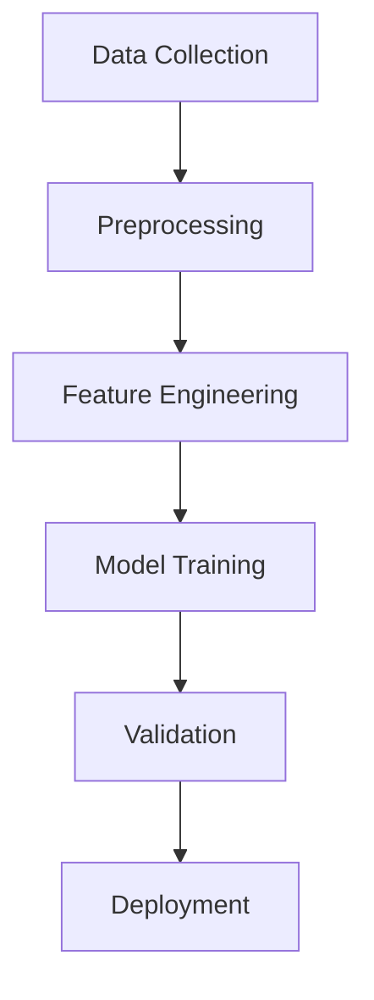
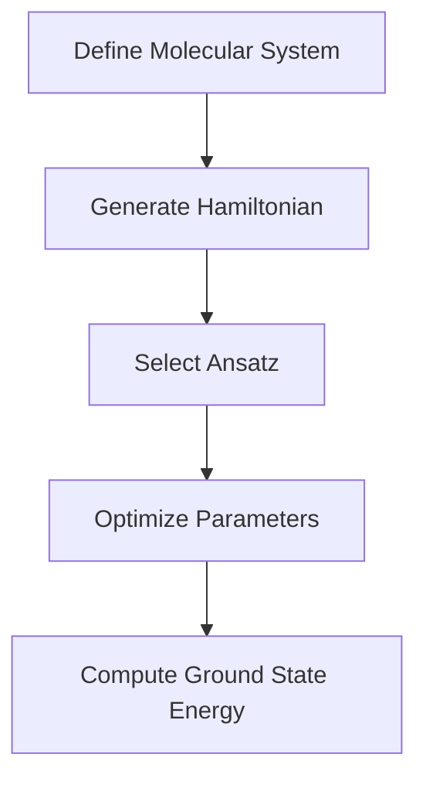

# Visual Aids for Computational Drug Discovery

## Drug Discovery Pipeline

## Comparison of Tools and Libraries

| Category           | Tools/Libraries                     | Key Features                          |
|--------------------|-------------------------------------|---------------------------------------|
| Cheminformatics    | RDKit, Mordred, ChEMBL              | Molecular representations, descriptors|
| Machine Learning   | scikit-learn, PyTorch, TensorFlow   | Classification, regression, deep learning|
| Molecular Modeling | OpenMM, MDTraj, PyMOL               | Molecular dynamics, visualization     |
| Quantum Chemistry  | Psi4, PySCF                        | Electronic structure calculations     |
| Quantum Computing  | Qiskit, PennyLane, Cirq            | Quantum algorithms, simulations       |
| Drug Discovery     | DeepChem, ODDT, PLIP               | Virtual screening, ADMET prediction   |

## Quantum Computing Workflow

## ADMET Properties

| Property           | Description                         | Importance                            |
|--------------------|-------------------------------------|---------------------------------------|
| Absorption         | Drug uptake in the body            | Bioavailability                       |
| Distribution       | Drug spread in tissues             | Target specificity                    |
| Metabolism         | Drug breakdown by enzymes          | Toxicity                              |
| Excretion          | Drug removal from the body         | Safety                                |
| Toxicity           | Harmful effects of the drug        | Risk assessment                       |

---

These visual aids can be integrated into the main documentation to enhance understanding and engagement.
